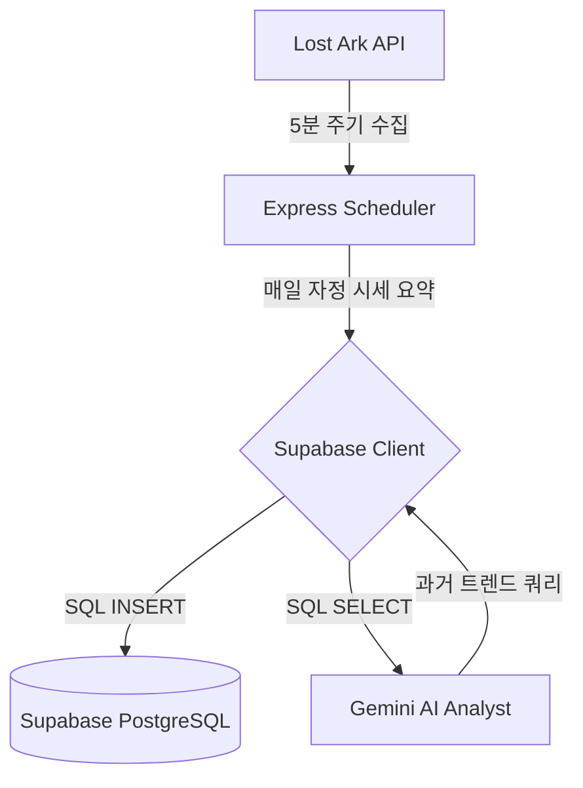

# 🚀 Supabase (PostgreSQL) 시세 데이터베이스 연동 기술 가이드

이 문서는 **LOSTVIBE** 플랫폼의 백그라운드 스케줄러가 매일 수집하는 로스트아크 보석 및 각인서 시세 데이터를 클라우드 SQL 서비스인 **Supabase (PostgreSQL)** 에 안전하게 적재하고 활용할 수 있도록 지원하는 실전 개발 가이드입니다.

---

## 📌 Supabase 연동 아키텍처 개요

기존에는 로컬 서버 파일인 `market_history.json`을 데이터베이스 대용으로 사용해 매일의 시세를 기록했으나, **Supabase**를 활용하면 클라우드 PostgreSQL에 데이터를 안전하게 누적 보관할 수 있습니다. 
이를 통해 데이터 분실 위험이 사라지고, 추후 다양한 플랫폼이나 외부 서비스로 시세 분석 서비스를 확장할 수 있습니다.



---

## 🛠️ Step 1. Supabase 테이블 스키마 디자인 (SQL DDL)

Supabase 대시보드의 **SQL Editor**에 접속하여 아래의 SQL DDL 쿼리를 실행해 시세 히스토리 테이블을 생성합니다.

```sql
-- 1. 보석 일별 최저가 히스토리 테이블 생성
CREATE TABLE gem_prices_history (
    id BIGINT GENERATED BY DEFAULT AS IDENTITY PRIMARY KEY,
    collected_date DATE DEFAULT CURRENT_DATE NOT NULL, -- 수집 일자 (중복 수집 방지용 고유 날짜)
    item_name VARCHAR(100) NOT NULL,                   -- 보석 이름 (예: 10레벨 겁화의 보석)
    min_price INT NOT NULL,                            -- 당일 최저 즉시구매가
    created_at TIMESTAMP WITH TIME ZONE DEFAULT TIMEZONE('utc'::text, NOW()) NOT NULL
);

-- 인덱스 추가 (조회 속도 향상)
CREATE INDEX idx_gem_date ON gem_prices_history (collected_date);
CREATE INDEX idx_gem_name ON gem_prices_history (item_name);

-- 동일 날짜 + 동일 아이템 중복 적재 방지 유니크 제약
ALTER TABLE gem_prices_history ADD CONSTRAINT uq_gem_date_name UNIQUE (collected_date, item_name);


-- 2. 유물 각인서 일별 최저가 히스토리 테이블 생성
CREATE TABLE engraving_prices_history (
    id BIGINT GENERATED BY DEFAULT AS IDENTITY PRIMARY KEY,
    collected_date DATE DEFAULT CURRENT_DATE NOT NULL, -- 수집 일자
    item_name VARCHAR(100) NOT NULL,                   -- 각인서 이름 (예: 원한, 아드레날린)
    min_price INT NOT NULL,                            -- 당일 최저가
    created_at TIMESTAMP WITH TIME ZONE DEFAULT TIMEZONE('utc'::text, NOW()) NOT NULL
);

-- 인덱스 추가
CREATE INDEX idx_engraving_date ON engraving_prices_history (collected_date);
CREATE INDEX idx_engraving_name ON engraving_prices_history (item_name);

-- 동일 날짜 + 동일 각인서 중복 적재 방지 유니크 제약
ALTER TABLE engraving_prices_history ADD CONSTRAINT uq_engraving_date_name UNIQUE (collected_date, item_name);
```

---

## 📦 Step 2. 백엔드 패키지 설치 및 환경 변수 설정

서버 프로젝트 디렉토리에서 Supabase 연동에 필요한 공식 Node.js SDK를 설치합니다.

```bash
npm install @supabase/supabase-js
```

이후 프로젝트 루트의 `.env` 파일에 Supabase 프로젝트 설정에서 복사한 URL 및 API Key(Service Role Key 권장)를 기재합니다.

```env
# Supabase 설정
SUPABASE_URL=https://your-supabase-project-id.supabase.co
SUPABASE_SERVICE_ROLE_KEY=eyJhbGciOiJIUzI1NiIsInR5cCI6IkpXVCJ9...
```

> [!IMPORTANT]
> 백엔드 스케줄러가 Row Level Security(RLS) 제약 없이 자유롭게 데이터를 Write해야 하므로, `anon key` 대신 반드시 `service_role_key`를 사용해 연결해 주세요. 해당 키는 서버 측 환경 변수로만 안전하게 관리되어야 합니다.

---

## 💻 Step 3. server.js 백엔드 코드 연동 및 마이그레이션

현재 JSON 파일을 다루고 있는 `server.js` 파일의 DB 파트를 Supabase용 코드로 치환하는 가이드입니다. 

### 1) Supabase 클라이언트 초기화 (server.js 상단 추가)

```javascript
import { createClient } from '@supabase/supabase-js';
import dotenv from 'dotenv';
dotenv.config();

// Supabase 클라이언트 초기화
const supabaseUrl = process.env.SUPABASE_URL;
const supabaseKey = process.env.SUPABASE_SERVICE_ROLE_KEY;

if (!supabaseUrl || !supabaseKey) {
  console.warn('⚠️ [Supabase] SUPABASE_URL 또는 SUPABASE_SERVICE_ROLE_KEY 환경변수가 정의되지 않았습니다. 로컬 테스트 모드로 작동합니다.');
}

const supabase = (supabaseUrl && supabaseKey) 
  ? createClient(supabaseUrl, supabaseKey) 
  : null;
```

### 2) 일별 시세 저장 함수 개편 (`saveDailyMarketHistory` 함수 대체)

기존의 `market_history.json` 파일 쓰기 함수를 Supabase Table `upsert` 로직으로 교체합니다.

```javascript
/**
 * 매일 수집된 보석 및 각인서 시세를 Supabase PostgreSQL 데이터베이스에 영구 적재합니다.
 */
const saveDailyMarketHistory = async (gems, engravings) => {
  if (!gems || !engravings || gems.length === 0 || engravings.length === 0) return;
  
  if (!supabase) {
    console.error('💾 [DB] Supabase 연결이 설정되지 않아 데이터 저장을 취소합니다.');
    return;
  }

  try {
    const todayStr = new Date().toISOString().split('T')[0];

    // 1. 보석 데이터 벌크 적재 데이터 포맷팅
    const gemPayloads = gems.map(g => ({
      collected_date: todayStr,
      item_name: g.Name,
      min_price: g.CurrentMinPrice
    }));

    // 2. 각인서 데이터 벌크 적재 데이터 포맷팅
    const engravingPayloads = engravings.map(e => ({
      collected_date: todayStr,
      item_name: e.Name,
      min_price: e.CurrentMinPrice
    }));

    // 3. Supabase Upsert 실행 (중복 발생 시 자동 업데이트)
    const [gemRes, engravingRes] = await Promise.all([
      supabase.from('gem_prices_history').upsert(gemPayloads, { onConflict: 'collected_date,item_name' }),
      supabase.from('engraving_prices_history').upsert(engravingPayloads, { onConflict: 'collected_date,item_name' })
    ]);

    if (gemRes.error) throw new Error(`보석 저장 실패: ${gemRes.error.message}`);
    if (engravingRes.error) throw new Error(`각인서 저장 실패: ${engravingRes.error.message}`);

    console.log(`💾 [Supabase] 오늘의 시세 데이터가 클라우드 DB에 동기화 완료되었습니다. (${todayStr})`);
  } catch (err) {
    console.error('💾 [Supabase] 시세 히스토리 DB 적재 에러 발생:', err.message);
  }
};
```

### 3) AI 분석용 데이터 조회 함수 개편 (`/api/analyze` 라우터 내부)

기존 JSON 파일 조회 대신, Supabase PostgreSQL로부터 최근 30일치 시세 데이터를 쿼리해 Gemini AI 프롬프트에 동적으로 공급하는 라우터 리팩토링 예시입니다.

```javascript
app.post('/api/analyze', async (req, res) => {
  try {
    if (!supabase) {
      return res.status(500).json({ error: 'Supabase 데이터베이스가 연결되어 있지 않습니다.' });
    }

    // 1. Supabase에서 과거 30일치 데이터 조회
    const today = new Date();
    const thirtyDaysAgo = new Date(today);
    thirtyDaysAgo.setDate(today.getDate() - 30);
    const startDateStr = thirtyDaysAgo.toISOString().split('T')[0];

    const [gemQuery, engravingQuery] = await Promise.all([
      supabase
        .from('gem_prices_history')
        .select('collected_date, item_name, min_price')
        .gte('collected_date', startDateStr)
        .order('collected_date', { ascending: true }),
      supabase
        .from('engraving_prices_history')
        .select('collected_date, item_name, min_price')
        .gte('collected_date', startDateStr)
        .order('collected_date', { ascending: true })
    ]);

    if (gemQuery.error) throw gemQuery.error;
    if (engravingQuery.error) throw engravingQuery.error;

    // 2. AI 분석 프롬프트 주입용 데이터 구조화
    const gemData = gemQuery.data;
    const engravingData = engravingQuery.data;

    // (참고) AI에게 전달할 마샬링 데이터 가공
    const formattedHistory = {};
    
    // 보석 그룹화
    gemData.forEach(row => {
      const date = row.collected_date;
      if (!formattedHistory[date]) formattedHistory[date] = { gems: [], engravings: [] };
      formattedHistory[date].gems.push({ Name: row.item_name, CurrentMinPrice: row.min_price });
    });

    // 각인서 그룹화
    engravingData.forEach(row => {
      const date = row.collected_date;
      if (!formattedHistory[date]) formattedHistory[date] = { gems: [], engravings: [] };
      formattedHistory[date].engravings.push({ Name: row.item_name, CurrentMinPrice: row.min_price });
    });

    // 3. Gemini 프롬프트 작성 및 실행
    const systemPrompt = `당신은 로스트아크 경제 구조 분석에 특화된 프로페셔널 AI 경제 애널리스트입니다.`;
    const userPrompt = `
과거 30일 동안의 로스트아크 4티어 보석 및 유물 각인서 최저가 일별 시세 히스토리 데이터는 다음과 같습니다:
${JSON.stringify(formattedHistory, null, 2)}

이 데이터를 기반으로 아래의 2가지 항목만 정밀하게 분석하여 마크다운 포맷으로 출력해 주세요.
불필요한 인사말이나 부연 설명 없이, 지정된 2개 단락의 헤더(###)만 사용하여 기술적이고 정량적인 요약을 제시하세요.

### 1. 보석 시세 전망
- 7~10레벨 겁화/작열 보석의 가격 추세를 정량적으로 요약하세요.
- 과거 데이터 대비 현재 가격의 위치(저점, 고점, 지지선)를 분석하고, 단기(일주일 내) 및 중기 가격 전망을 설명하세요.
- 공대 참여용이나 골드 가치 방어 목적 등 실전적인 팁을 기재해 주세요.

### 2. 각인서 시세 전망
- 상위 15종 유물 각인서의 최저가 흐름을 정밀 분석하세요.
- 어떤 각인서가 최근 가장 큰 등락을 기록했으며, 다가오는 레이드 패치나 메타 변화에 발맞춰 어떤 방향성을 띨지 전망해 주세요.
- 분배금 정산 프리셋에 참고할 만한 각인서 경매 구매 추천 가이드를 덧붙여 주세요.
`;

    // (이후 Gemini API Call 로직 수행 및 타자기 뷰어로 전송)
    // const result = await geminiModel.generateContent([systemPrompt, userPrompt]);
    // res.json({ report: result.response.text() });

  } catch (err) {
    console.error('AI 분석 실패:', err.message);
    res.status(500).json({ error: 'AI 분석 중 데이터베이스 쿼리 또는 API 오류가 발생했습니다.' });
  }
});
```

---

## ✨ Supabase 마이그레이션이 제공하는 이점
1. **서버리스 데이터베이스 안정성**: 로컬 파일 시스템 손상에 따른 백업 파일 파손 리스크가 100% 영구 해결됩니다.
2. **PostgreSQL 강력한 집계 기능**: 단순 AI용 덤프뿐만 아니라, `AVG()`, `STDDEV()` 등의 SQL 통계 함수를 이용해 평균 이동선(MA), 가격 변동 계수 등을 서버 사이드에서 실시간 연산하여 차트 대시보드로 확장하기 무척 쉬워집니다.
3. **글로벌 인프라 확장성**: Supabase REST API 및 실시간(Realtime) 구독 기능을 활용해 프론트엔드가 백엔드를 거치지 않고 직접 실시간 테이블 변화를 감지할 수도 있습니다.
