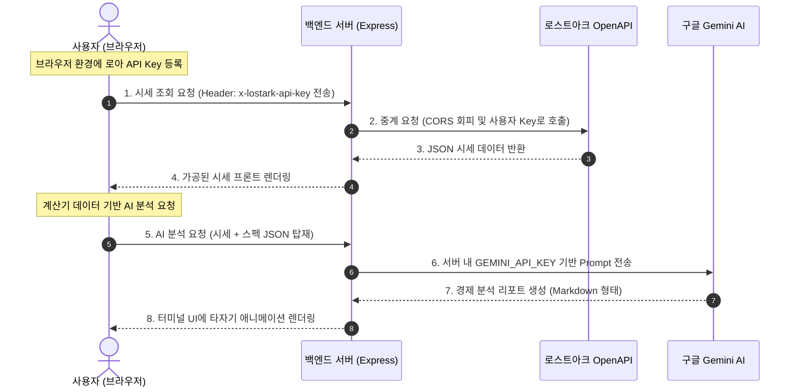

# 📝 [PRD] 로스트아크 하이브리드 유틸리티 포털 (LOSTVIBE Portal)

본 문서는 로스트아크 시즌 3 아크 패시브 및 4티어 경제 시스템에 맞춤 설계된 고성능 하이브리드 유틸리티 포털 **'LOSTVIBE'**의 제품 요구사항 명세서(PRD)입니다. 포트폴리오 및 기술 블로그 업로드용으로 가공하기 적합하도록 기술적 의사결정 과정과 정밀한 연산 공식, 시스템 아키텍처를 상세히 기록하였습니다.

---

## 1. 프로젝트 개요 (Project Overview)

### 1.1 배경 및 목적 (Background & Objective)
로스트아크 시즌 3 및 4티어 업데이트 이후, 게임 내 경제(융화 재료 제작, 보석 합성, 낙원 보상)와 스펙 세팅(아크 패시브 진화 노드: 음속 돌파, 뭉툭한 가시)의 연산 복잡도가 극대화되었습니다. 
유저들은 실시간 시세를 반영한 최적의 손익분기점과 최적화된 특성 효율을 구하기 위해 매번 복잡한 엑셀 시트나 커뮤니티 공략집을 수동으로 탐색해야 하는 심각한 페인 포인트(Pain Point)를 겪고 있습니다.

**LOSTVIBE**는 이러한 유저들의 불편함을 한곳에서 실시간으로 해결하는 **'프리미엄 원스톱 하이브리드 포털 서비스'**입니다. 

### 1.2 핵심 가치 제안 (Value Proposition)
* **Real-time & AI-driven:** 실시간 로스트아크 OpenAPI 거래소 시세와 구글 Gemini AI 애널리스트를 융합하여 단순 수치 제공을 넘어 행동 촉구(Actionable Insights) 리포트를 제공합니다.
* **Hybrid Architecture:** 서버의 높은 보안성과 API 호출 제한(Rate Limit)을 분산하는 하이브리드 구조를 통해 운영 비용 $0$에 수렴하는 상용화 가능한 설계를 지향합니다.
* **Premium UX:** 게이머 감성을 저격하는 퓨처리스틱 네온 사이버펑크 테마와 매끄러운 단일 페이지 애플리케이션(SPA) 반응형 웹을 제공합니다.

---

## 2. 시스템 아키텍처 및 기술 스택 (Architecture & Tech Stack)

### 2.1 기술 스택 (Tech Stack)
* **Frontend:** HTML5, Vanilla CSS3 (Custom Design System Token), JavaScript (ES6+ SPA Dynamic Navigation)
* **Backend:** Node.js, Express (API Gateway, HTTP Proxy Router)
* **External APIs:** LOSTARK OpenAPI, Google Gemini 1.5 Flash API
* **Deployment Friendly:** `.env` 기반 환경 설정, 경량 무의존성 지향

### 2.2 시스템 흐름도 (Data Flow Diagram)

---

## 3. 핵심 기능 요구사항 (Product Specifications)

### 3.1 [Home] 실시간 캘린더 대시보드 (Today's Schedule)
* **기능 요약:** 오늘 하루 열리는 주요 모험 섬, 필드 보스, 카오스 게이트 스케줄을 실시간으로 확인하고 잔여 대기 시간을 안내합니다.
* **상세 기능:**
  * **API 연동:** `/gamecontents/calendar`를 호출하여 실시간 게임 내 이벤트 데이터를 바인딩합니다.
  * **폴백(Fallback) 모듈:** API Key가 등록되지 않았을 경우, 기기 로컬 시간을 바탕으로 요일별 표준 규칙(월/목/토/일 - 카게, 화/금/일 - 필보)을 자동 계산해 동적으로 표시해 줍니다.
  * **시간 카운트다운:** 실시간 카운트다운 엔진을 적용하여 다음 출현 시점까지 남은 시/분/초를 동적으로 노출합니다.

### 3.2 [Tool 1] 아비도스 제작 효율 계산기 (+ 영지 타이머)
* **기능 요약:** 생활 재료 시세를 바탕으로 아비도스/상급 아비도스 융화 재료를 직접 제작하여 판매할 때의 순수익을 비교 진단합니다.
* **제작 레시피 데이터 공식 (기본 출력량 30개 기준):**
  * **일반 아비도스 융화 재료:** 하위 재료 86개, 중위 재료 45개, 상위 재료 33개 소모 (기본 제작비: 400G / 활동력: 288)
  * **상급 아비도스 융화 재료:** 하위 재료 112개, 중위 재료 59개, 상위 재료 43개 소모 (기본 제작비: 520G / 활동력: 360)
* **연산 공식 (Mathematical Formulation):**
  * **수정 제작비 ($C_{craft}$):** $기본\_제작비 \times (1 - 제작\_수수료\_할인율 / 100)$
  * **원료비 ($C_{material}$):** $\sum \left( \frac{재료별\_시세(100개당)}{100} \times 소모\_개수 \right)$
  * **총 제작 단가 ($C_{total}$):** $C_{craft} + C_{material}$
  * **기대 매출 ($R_{expected}$):** $판매\_시세(30개묶음) \times (1 + 대성공\_확률 / 100) \times (1 - 수수료(0.05))$
  * **회당 순수익 ($P$):** $R_{expected} - C_{total}$
* **서브 툴 (영지 타이머):**
  * 현재 활동력과 목표 제작 횟수를 입력하면 완충까지 남은 시간 실시간 타이머 작동 및 총 제작 완료 시점을 표시합니다.

### 3.3 [Tool 2] 스펙 및 아크 패시브(음속돌파/뭉툭한가시) 진단기
* **기능 요약:** 사용자의 전투 스탯(치명, 신속) 및 시너지를 입력받아 최신 4티어 아크 패시브 진화 노드 2종의 실제 효율을 수학적으로 진단합니다.
* **상세 기능:**
  * **치명타 확률(치적) 계산 공식:**
    * $스탯\_치적 = 치명\_스탯 \times 0.0357\%$
    * $최종\_치적(C_{calc}) = 스탯\_치적 + 아드레날린(5/10/20\%) + 시너지(10/18\%) + 팔찌(정밀\_등) + 기타\_수동\_추가$
    * *(※ 복잡도를 낮추기 위해 카드 및 엘릭서는 항목에서 제외함)*
  * **뭉툭한 가시(뭉가) 효율 진단 공식:**
    * **패널티 적용 최종 치적 ($C_{final}$):** $\min(80\%, C_{calc})$
    * **초과 치적 ($\Delta C$):** $\max(0, C_{calc} - 80\%)$
    * **변환된 진화형 피해 증가율 ($ED$):**
      * 뭉가 1레벨: $\min(52.5\%, \Delta C \times 1.25)$
      * 뭉가 2레벨: $\min(75.0\%, \Delta C \times 1.50)$
    * **기존 일반 딜 기댓값 ($E_{normal}$):** $1 + (C_{calc} / 100 \times (치피 - 1))$  (단, $C_{calc}$ 상한 100%)
    * **뭉가 채용 시 딜 기댓값 ($E_{munga}$):** $[1 + (C_{final} / 100 \times (치피 - 1))] \times (1 + ED / 100)$
    * **실질 딜 증폭 효율 ($Eff$):** $\left( \frac{E_{munga}}{E_{normal}} - 1 \right) \times 100\%$
  * **공이속 및 음속돌파 효율 계산 공식:**
    * $스탯\_공이속 = 신속\_스탯 \times 0.01717\%$
    * $최종\_공이속 = 스탯\_공이속 + 갈망\_버프(8/10/12\%) + 만찬(5\%) + 자버프 - 질량증가(-10\%)$
    * **음돌 진화 피해량:** 140% 상한 초과분인 $\max(0, 공속 - 140) + \max(0, 이속 - 140)$의 합산 $A_{excess}$에 대해 $\text{진피증} = A_{excess} \times 0.3$ 연산 (최대 추가 8%).
    * 목표치인 306.67% 기준 달성도 게이지 및 피드백 출력.

### 3.4 [Tool 3] 실시간 시세 및 Gemini AI 분석기
* **기능 요약:** 각인서 책 및 보석 시세를 한눈에 파악하고, 서버 사이드 Gemini AI를 통해 로스트아크 전문 경제 보고서를 받아봅니다.
* **상세 기능:**
  * **시세 조회:** `/api/market`을 경유하여 멸화/홍염, 겁화/작열 보석 실시간 시세 및 직업/전투 전설/유물 각인서 시세 연동.
  * **Gemini AI 코칭 (`/api/analyze`):**
    * 서버에 안전하게 은닉된 구글 Gemini API Key를 사용합니다.
    * 수집된 모든 시세 JSON 데이터와 제작 손익 계산 결과를 백엔드에서 미리 구조화된 템플릿 프롬프트로 병합합니다.
    * **시스템 프롬프트 예시:** `"너는 로스트아크 골드 경제학자이자 프로 게이머이다. 주어진 데이터(제작 손익, 보석 및 각인서 가격)를 분석하여 유저에게 현재 골드 파밍 효율을 높이기 위해 해야 할 액션을 3가지 요약해 줘. 존댓말로 아주 고급스럽고 전문적이게 작성해 줘."`
    * AI 분석 리포트를 터미널 폰트 디자인의 프론트엔드 리포트 창에 타자기 애니메이션(Typewriter Effect)으로 역동적으로 렌더링합니다.

### 3.5 [Tool 4] 레이드 경매 분배금 계산기
* **기능 요약:** 레이드 전리품 경매 입찰 시 손해를 보지 않는 한도와 최대 이득 한도를 도출합니다.
* **연산 공식:**
  * **손익분기점 입찰가 (적정 낙찰가 - $B_{break\_even}$):** $거래소\_시세 \times 0.95 \times \frac{N-1}{N}$ (단, $N$은 공대 인원 4인 / 8인 / 16인)
  * **추천 선점 입찰가 ($B_{recommend}$):** $B_{break\_even} \div 1.1$ (자신이 낙찰 시 수수료를 빼고도 10%의 확실한 마진을 확보할 수 있는 입찰가)

---

## 4. UI/UX 디자인 요구사항 (UI/UX Specification)

### 4.1 글로벌 디자인 시스템 토큰 (CSS Design System Tokens)
* **Background Dark:** `hsl(224, 25%, 8%)` (우주와 깊은 심연을 형상화한 심층 다크 모드)
* **Card Material:** `hsla(224, 25%, 15%, 0.7)` (반투명 백그라운드 및 블러 효과 적용 - Glassmorphism)
* **Accent Colors (Neon Glow):**
  * Cyan (주요 인터랙션): `hsl(180, 100%, 50%)`
  * Purple (AI 및 고급 아이템): `hsl(280, 100%, 60%)`
  * Gold (경매/골드 혜택): `hsl(45, 100%, 55%)`
  * Green (이득 흑자): `hsl(145, 90%, 45%)`
  * Red (손해 적자): `hsl(355, 90%, 50%)`
* **Typography:** Modern Sans-Serif (Google Fonts: Outfit / Pretendard 적용)

### 4.2 마이크로 인터랙션 (Micro-interactions)
* **3D Tilt Hover Effect:** 메인 포털 화면의 5개 카드 메뉴 호버 시, 마우스 좌표 방향으로 카드가 입체적으로 기울어지며 쉐도우 글로우가 퍼지는 연출을 CSS Transform과 미적용 대비 효과로 구현.
* **AI Terminal Typist:** AI 리포트 렌더링 시 텍스트가 깜빡이는 커서와 함께 흐르듯 출력되는 타자기 연출을 적용하여 시각적 몰입감을 배가.
* **Smooth SPA Transitions:** 탭 클릭 시 주소창 해시 변경 감지(`hashchange` 이벤트 바인딩)를 통해 자연스러운 페이드 아웃/페이드 인 페이지 트랜지션 처리.

---

## 5. 보안 및 성능 요구사항 (Non-Functional Specification)

### 5.1 개인정보 및 API Key 보안
* 사용자의 **로스트아크 API Key**는 백엔드 DB나 파일에 영구 저장되지 않고, 오직 브라우저의 **LocalStorage**에 암호화 보존됩니다.
* 서버는 단순 프록시(Proxy Interface) 역할만 수행하여 데이터를 가로채거나 타 서버로 유출하는 루트를 차단합니다.
* 서버의 **Gemini API Key**는 로컬 파일 `.env`에 은닉되어 클라이언트로 일체 리턴되지 않습니다.

### 5.2 반응형 브라우저 최적화 (Responsiveness)
* **데스크톱:** 1200px 이상 Grid 다단 구성.
* **태블릿:** 768px~1024px Grid 2열 구성 및 사이드바 간소화.
* **모바일:** 767px 이하 카드 세로 나열 1열 배치, 하단 모바일 고정 탭 바 네비게이션 제공.
